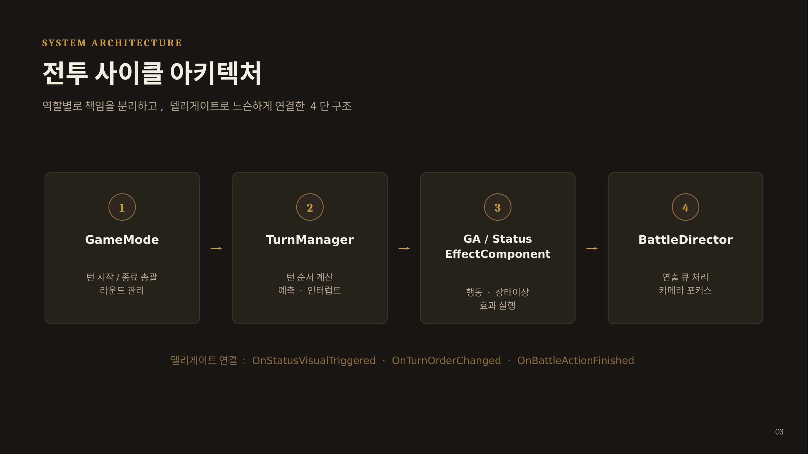
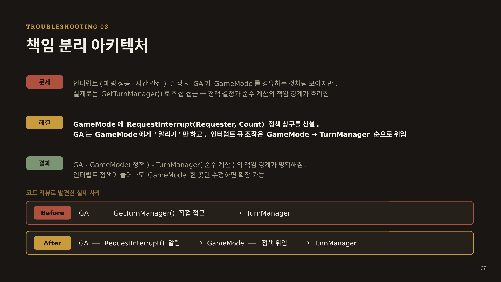

# 전투 시스템 사이클 — GAS 기반 턴제 전투 로그라이크

Unreal Engine 5.5.4 / C++ / Blueprint / Gameplay Ability System(GAS) 기반 3D 턴제 전투 로그라이크 게임의 **전투 시스템 사이클** 파트를 담당했습니다.

- **장르**: 3D 턴제 전투 로그라이크
- **개발 인원**: 4인 팀 프로젝트
- **개발 기간**: (기간 입력)
- **담당 영역**: Turn System · Combat System · Status Effect System · Parry System
- **플레이 영상**: (영상 준비 후 링크 추가 예정)

---

## 목차

1. [프로젝트 개요](#프로젝트-개요)
2. [아키텍처](#아키텍처)
3. [트러블슈팅 1 — GAS와 턴제 연출 타이밍의 충돌](#트러블슈팅-1--gas와-턴제-연출-타이밍의-충돌)
4. [트러블슈팅 2 — 턴 순서 시스템 이중 트랙 설계](#트러블슈팅-2--턴-순서-시스템-이중-트랙-설계)
5. [트러블슈팅 3 — 책임 분리: GA가 TurnManager를 직접 조작하던 문제](#트러블슈팅-3--책임-분리-ga가-turnmanager를-직접-조작하던-문제)
6. [C++ / Blueprint 하이브리드 워크플로우](#c--blueprint-하이브리드-워크플로우)
7. [기술 스택](#기술-스택)

---

## 프로젝트 개요

GAS(GameplayAbilitySystem)를 턴제 전투에 맞게 커스터마이징하여, 다음 시스템들을 설계·구현했습니다.

- **턴 사이클 관리**: 라운드/턴 시작·종료, 승패 판정 (`GameMode`)
- **턴 순서 계산**: 게이지 기반 일반 턴 + 인터럽트(끼어들기) 턴 이중 트랙, 미래 턴 순서 예측 (`TurnManager`)
- **상태이상 시스템**: DoT, 턴 감소, 연출-데미지 타이밍 동기화 (`StatusEffectComponent`)
- **패링/반격 시스템**: 실시간 입력 기반 패링 판정, 성공 시 자동 반격 턴 부여
- **연출 큐 관리**: 상태이상 연출을 순서대로 재생하고 카메라를 포커싱 (`BattleDirector`)

GAS는 원래 실시간 액션 게임을 위한 프레임워크이기 때문에, "적용 즉시 반영"이라는 기본 동작 방식과 "연출 → 데미지 반영"이 순서대로 지켜져야 하는 턴제 요구사항이 자주 충돌했습니다. 이 프로젝트의 핵심은 **GAS의 표준 흐름을 유지하면서 턴제에 필요한 타이밍 제어를 별도 레이어로 얹은 것**입니다.

---

## 아키텍처

```
GameMode (턴 시작/종료 총괄, 라운드 관리)
    ↓
TurnManager (턴 순서 계산, 예측, 인터럽트)
    ↓
GA / StatusEffectComponent (행동·상태이상 효과 실행)
    ↓
BattleDirector (연출 큐 처리, 카메라 포커스)
```



각 시스템은 델리게이트(`OnStatusVisualTriggered`, `OnTurnOrderChanged`, `OnBattleActionFinished`)로 느슨하게 연결되어 있어, 연출 방식이 바뀌어도 턴 계산 로직에는 영향을 주지 않습니다.

---

## 트러블슈팅 1 — GAS와 턴제 연출 타이밍의 충돌

### 문제
`GameplayEffect`(GE)는 적용 즉시 수치가 반영되는 것이 GAS의 기본 동작입니다. 상태이상 GE를 그대로 적용하면 VFX 연출이 끝나기도 전에 체력이 먼저 깎여버려, 턴제 전투에서 요구되는 "상태이상 적용 → 연출 재생 → 데미지 반영" 순서가 깨졌습니다.

### 해결
`TMap<AActor*, TArray<FGameplayEffectSpecHandle>> PendingDamageMap`에 데미지 스펙을 임시로 보관하고, 연출이 끝나는 시점(Blueprint에서 VFX 재생 + Delay로 타이밍 제어)에 `ExecutePendingDamage()`를 호출해 실제 GE를 적용하는 2단계 구조로 분리했습니다. GAS의 표준 흐름(GE)은 그대로 두고, 타이밍만 별도 레이어에서 제어하는 방식입니다.

```
상태이상 적용 → PendingDamageMap에 예약 → VFX 재생(+Delay) → ExecutePendingDamage() → 다음 시퀀스(BattleDirector)
```

`bIsInstant` 플래그로 즉발형/연출형을 분기하여, 고정 데미지처럼 즉시 터져야 하는 효과는 VFX는 유지하되 Delay만 생략하도록 처리했습니다.

### 결과
상태이상 종류가 늘어나도 GE 로직 수정 없이 연출-데미지 타이밍의 일관성이 유지됩니다. `OnStatusVisualTriggered` 델리게이트로 `BattleDirector`의 연출 큐와도 자연스럽게 연동됩니다.

**역할 분리**: C++에서는 `ExecutePendingDamage()`, `OnStatusVisualTriggered` 델리게이트로 실행 가능한 시점과 구조를 정의하고, Blueprint에서는 VFX 재생 시점과 Delay 수치(0.4s/1.2s)를 반복 테스트하며 튜닝했습니다.

---

## 트러블슈팅 2 — 턴 순서 시스템 이중 트랙 설계

### 문제
일반 턴(게이지 기반 순서)과 VIP 턴(패링 성공, 시간 간섭 스킬 등으로 인한 즉시 끼어들기)이 동시에 존재할 때 진행 순서가 꼬이는 문제가 있었습니다.

### 해결
`TurnQueue`(일반, 게이지 기반)와 `InterruptQueue`(우선순위)를 분리하고, `CalculateNextTurn()` 내부에서 인터럽트 큐를 먼저 확인해 우선 소비하도록 구성했습니다. 또한 `PredictTurnOrder()`로 실제 게이지 상태를 변경하지 않고 미래 N턴의 순서만 시뮬레이션하여 턴 타임라인 UI에 반영합니다.

```
TurnQueue(게이지 기반) ─┐
                          ├─→ CalculateNextTurn() → CurrentTurnActor 결정
InterruptQueue(VIP 턴) ──┘
```

### 결과
새로운 인터럽트 트리거가 추가되어도 기존 턴 로직 수정 없이 확장 가능합니다. UI 턴 타임라인도 실제 상태 변경 없이(사이드 이펙트 없이) 갱신됩니다.

---

## 트러블슈팅 3 — 책임 분리: GA가 TurnManager를 직접 조작하던 문제

코드 리뷰 중 실제로 발견하고 리팩터링한 사례입니다.

### 문제
패링 성공이나 시간 간섭 스킬처럼 인터럽트가 발생하는 상황에서, GA(`GrantExtraTurns()`)가 `GameMode`를 경유하는 것처럼 보였지만 실제로는 `GetTurnManager()`로 `TurnManager`에 직접 접근해 조작하고 있었습니다. "정책 결정(GameMode)"과 "순수 계산(TurnManager)"의 책임 경계가 흐려져 있었던 것입니다.

```cpp
// Before
void USPGA_BattleActionBase::GrantExtraTurns(int32 ExtraTurns)
{
    AASPCombatGameMode* GameMode = Cast<AASPCombatGameMode>(GetWorld()->GetAuthGameMode());
    for (int32 i = 0; i < ExtraTurns; ++i)
    {
        GameMode->GetTurnManager()->RequestInterruptTurn(Avatar); // TurnManager 직접 조작
    }
}
```

### 해결
`GameMode`에 `RequestInterrupt(AActor* Requester, int32 Count)`라는 정책 창구를 신설했습니다. GA는 이제 GameMode에게 "알리기"만 하고, 실제 인터럽트 큐 조작은 GameMode → TurnManager 순으로 위임합니다.

```cpp
// After
void USPGA_BattleActionBase::GrantExtraTurns(int32 ExtraTurns)
{
    AASPCombatGameMode* GameMode = Cast<AASPCombatGameMode>(GetWorld()->GetAuthGameMode());
    GameMode->RequestInterrupt(Avatar, ExtraTurns); // GameMode에게 알리기만 함
}

void AASPCombatGameMode::RequestInterrupt(AActor* Requester, int32 Count)
{
    for (int32 i = 0; i < Count; ++i)
    {
        TurnManager->RequestInterruptTurn(Requester); // 정책 결정 후 위임
    }
}
```

같은 맥락에서, `GameMode::ProcessEndOfTurn()`이 `PopInterruptActor()`로 인터럽트 큐를 먼저 소비한 뒤 `CalculateNextTurn()`을 호출하던 구조도 정리했습니다. `CalculateNextTurn()` 내부에도 동일한 인터럽트 큐 체크 로직이 있었는데, `PopInterruptActor()`가 항상 먼저 소비해버려서 사실상 죽은 코드였던 것입니다. `PopInterruptActor()`를 제거하고 `CalculateNextTurn()` 하나로 턴 순서 결정 책임을 완전히 `TurnManager`로 일원화했습니다.



### 결과
GA - GameMode(정책) - TurnManager(순수 계산)의 책임 경계가 명확해졌습니다. 인터럽트 정책이 늘어나도 `GameMode`의 `RequestInterrupt()` 한 곳만 수정하면 확장 가능합니다.

---

## C++ / Blueprint 하이브리드 워크플로우

- **C++**: `ExecutePendingDamage()`, `OnStatusVisualTriggered` 델리게이트 등으로 실행 가능한 시점과 구조를 정의
- **Blueprint**: VFX 재생 시점, Delay 수치 등 연출 타이밍을 반복 테스트하며 튜닝

언리얼 실무에서 흔한 C++/BP 병행 워크플로우를 그대로 따랐습니다. 로직의 뼈대(언제, 무엇을 실행 가능하게 할지)는 C++에서 인터페이스로 정의하고, 감각적으로 튜닝이 필요한 연출 타이밍은 BP에서 빠르게 반복 테스트했습니다.

---

## 기술 스택

- **Engine**: Unreal Engine 5.5.4
- **Language**: C++, Blueprint
- **Framework**: Gameplay Ability System (GAS)
- **Version Control**: Git

---

## Contact

- GitHub: (본인 GitHub 프로필 링크)
- Email: (이메일 주소 추가 예정)
