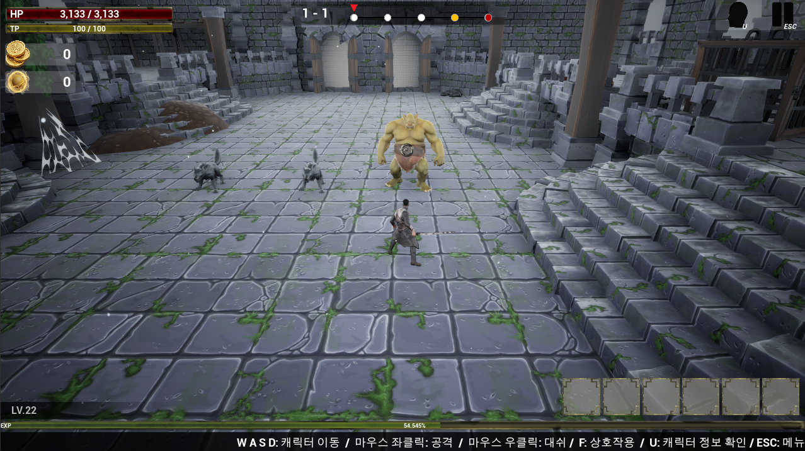
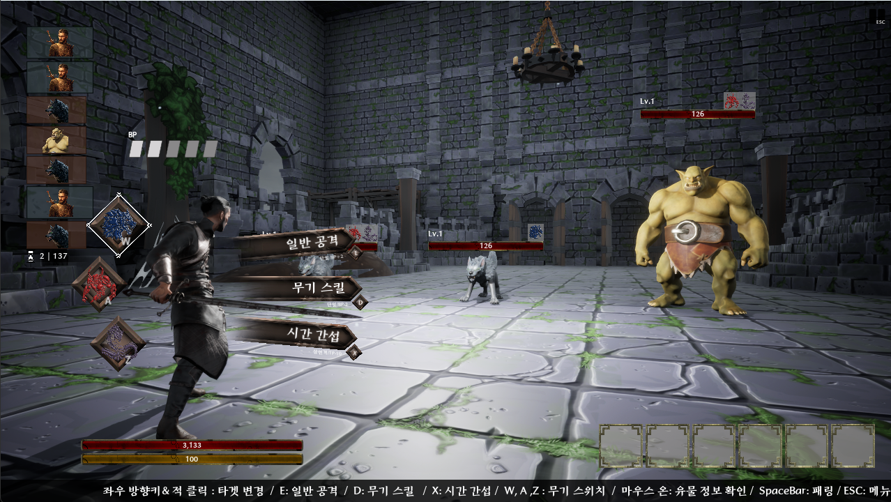
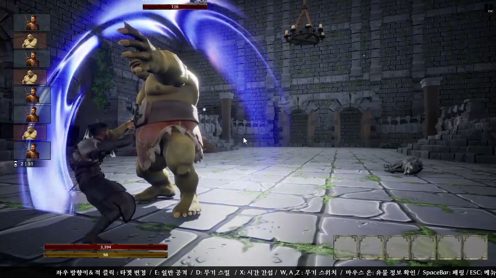
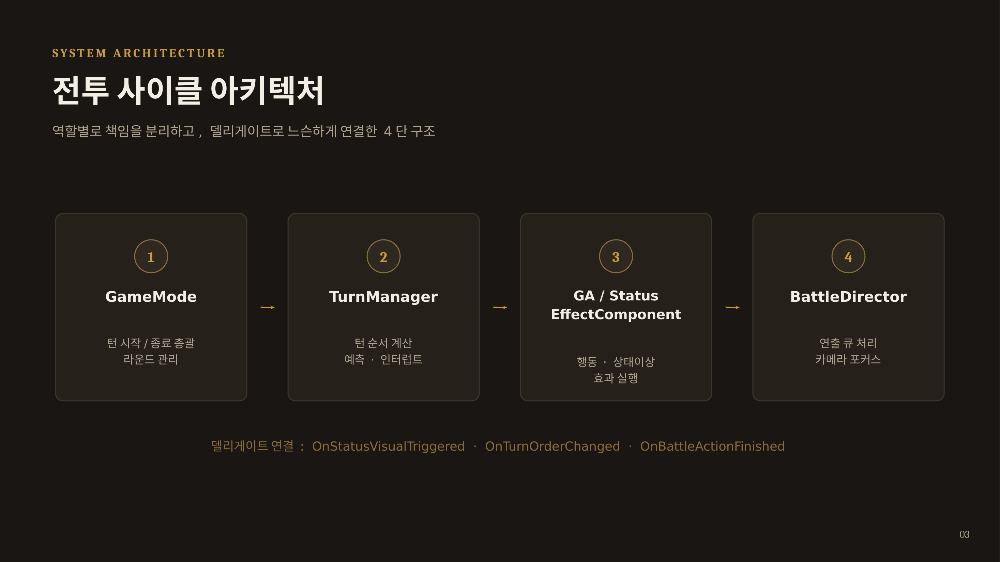
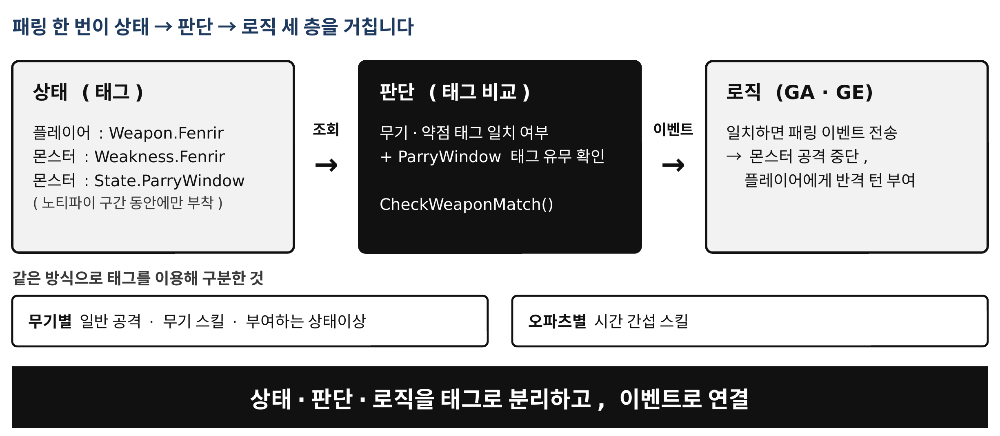
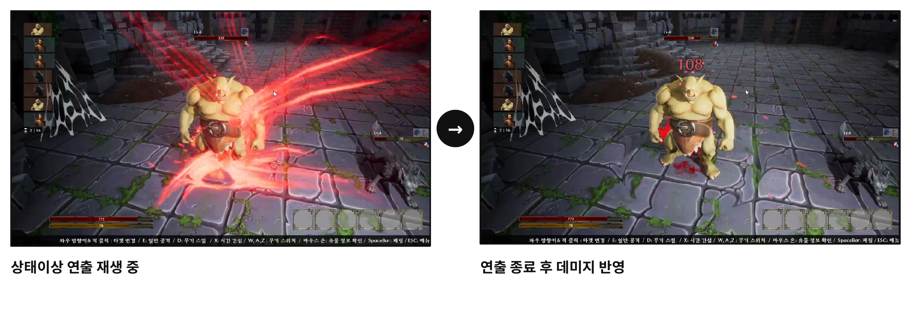
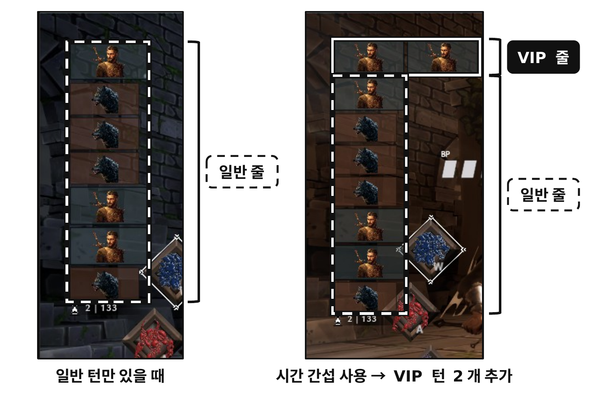
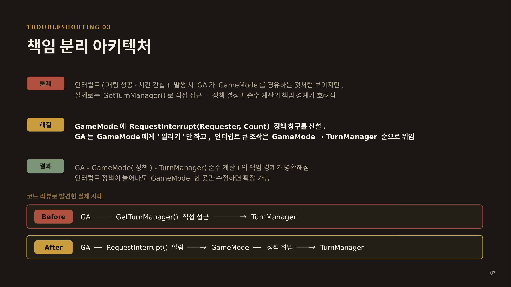
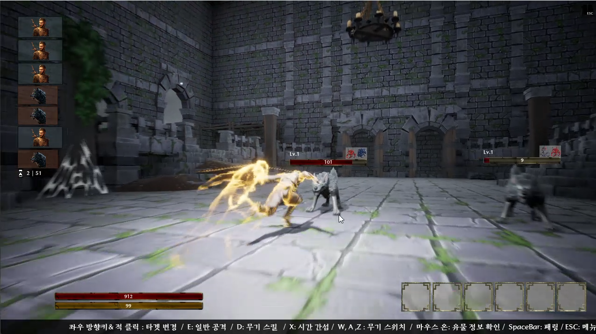

# 크로노클라즘 — 전투 시스템 사이클 (GAS 기반 턴제 전투 로그라이크)

> 추방당한 시간의 신이 시간을 조작해 신의 자리를 되찾아가는 다크 판타지 턴제 로그라이크

Unreal Engine 5.5.4 / C++ / Blueprint / Gameplay Ability System(GAS) 기반 3D 턴제 전투 로그라이크 게임 **크로노클라즘**에서 **전투 시스템 사이클** 파트를 담당했습니다.

<p align="center">
  
  
  
</p>
<p align="center"><sub>필드 탐험 · 턴제 전투 · 스킬 연출</sub></p>

- **장르**: 3D 턴제 전투 로그라이크
- **개발 인원**: 4인 팀 프로젝트
- **개발 기간**: 2025.05.16 ~ 2026.06.12
- **담당 영역**: Turn System · Combat System · Status Effect System · Parry System
- **플레이 영상**: [YouTube](https://youtu.be/pEEvE2xtDd0)

---

## 목차

1. [게임 소개](#게임-소개)
2. [프로젝트 개요](#프로젝트-개요)
3. [아키텍처](#아키텍처)
4. [설계 의도](#설계-의도)
5. [트러블슈팅 1 — GAS와 턴제 연출 타이밍의 충돌](#트러블슈팅-1--gas와-턴제-연출-타이밍의-충돌)
6. [트러블슈팅 2 — 턴 순서 시스템 이중 트랙 설계](#트러블슈팅-2--턴-순서-시스템-이중-트랙-설계)
7. [트러블슈팅 3 — 책임 분리: GA가 TurnManager를 직접 조작하던 문제](#트러블슈팅-3--책임-분리-ga가-turnmanager를-직접-조작하던-문제)
8. [C++ / Blueprint 하이브리드 워크플로우](#c--blueprint-하이브리드-워크플로우)
9. [기술 스택](#기술-스택)

---

## 게임 소개

시간의 신이었던 주인공이 인간으로 추방당한 뒤, 시간을 조작해 신의 자리를 되찾아가는 이야기입니다.

| 핵심 플레이 | 설명 |
|---|---|
| **필드 탐험** | 필드에서 몬스터를 공격하면 전투에 진입 |
| **턴제 전투** | 속도 기반 행동 게이지로 턴을 결정하고, 무기별 공격·스킬로 약점 속성을 공략 |
| **실시간 패링** | 적 공격 타이밍에 맞춰 패링을 입력하고, 성공하면 반격 턴을 획득 |
| **로그라이크 진행** | 층마다 맵을 선택해 보스까지 진행하고, 보상과 유물로 성장 |

---

## 프로젝트 개요

GAS(GameplayAbilitySystem)를 턴제 전투에 맞게 커스터마이징하여, 다음 시스템들을 설계·구현했습니다.

- **턴 사이클 관리**: 라운드/턴 시작·종료, 승패 판정 (`GameMode`)
- **턴 순서 계산**: 게이지 기반 일반 턴 + 인터럽트(끼어들기) 턴 이중 트랙, 미래 턴 순서 예측 (`TurnManager`)
- **상태이상 시스템**: DoT, 턴 감소, 연출-데미지 타이밍 동기화 (`StatusEffectComponent`)
- **패링/반격 시스템**: 실시간 입력 기반 패링 판정, 성공 시 자동 반격 턴 부여
- **연출 큐 관리**: 상태이상 연출을 순서대로 재생하고 카메라를 포커싱 (`BattleDirector`)

GAS는 원래 실시간 액션 게임을 위한 프레임워크이기 때문에, "적용 즉시 반영"이라는 기본 동작 방식과 "연출 → 데미지 반영"이 순서대로 지켜져야 하는 턴제 요구사항이 자주 충돌했습니다. 이 프로젝트의 핵심은 **GAS의 표준 흐름을 유지하면서 턴제에 필요한 타이밍 제어를 별도 레이어로 얹은 것**입니다.

---

## 아키텍처

```
GameMode (턴 시작/종료 총괄, 라운드 관리)
    ↓
TurnManager (턴 순서 계산, 예측, 인터럽트)
    ↓
GA / StatusEffectComponent (행동·상태이상 효과 실행)
    ↓
BattleDirector (연출 큐 처리, 카메라 포커스)
```



각 시스템은 델리게이트(`OnStatusVisualTriggered`, `OnTurnOrderChanged`, `OnBattleActionFinished`)로 느슨하게 연결되어 있어, 연출 방식이 바뀌어도 턴 계산 로직에는 영향을 주지 않습니다. 이 구조를 왜 이렇게 구성했는지는 다음 [설계 의도](#설계-의도)에 정리했습니다.

---

## 설계 의도

### 왜 GAS인가

상태이상·유물 같은 효과를 쉽게 관리하고, 무기를 하나의 상태(태그)로 취급해 그 상태에 맞는 공격 스킬(GA)을 연결하기 위해 GAS를 선택했습니다. 핵심은 **상태 → 판단 → 로직**을 태그와 이벤트로 분리해 연결하는 것입니다. 패링 한 번이 이 세 층을 모두 거칩니다.



- **상태 (태그)**: 플레이어는 `Weapon.Fenrir`, 몬스터는 `Weakness.Fenrir`와 `State.ParryWindow` 태그를 가집니다. `State.ParryWindow`는 애님 노티파이가 몽타주의 해당 구간 동안에만 몬스터에게 부착하고, 구간이 끝나면 제거합니다.
- **판단 (태그 비교)**: 플레이어가 패링을 시도하면 `CheckWeaponMatch()`가 무기·약점 태그의 일치 여부와 `ParryWindow` 태그의 유무를 확인해 성공/실패를 가릅니다.
- **로직 (GA·GE)**: 성공하면 몬스터에게 패링 이벤트(`Event.Battle.Parried`)를 보내 공격을 멈추게 하고, 플레이어에게 반격 턴을 부여합니다.

패링 타이밍을 별도의 타이머나 변수가 아니라 **태그가 붙어 있는 구간**으로 표현했기 때문에, 판단 로직은 타이밍 계산을 알 필요가 없습니다. 같은 방식으로 무기 태그별 일반 공격·무기 스킬·부여하는 상태이상, 오파츠 태그별 시간 간섭 스킬도 구분했습니다.

### 구조가 만들어진 과정

처음부터 4단 구조로 설계한 것이 아니라, 기능을 추가하면서 한 클래스에 역할이 몰릴 때마다 분리해 지금의 구조가 되었습니다.

| 단계 | 추가한 기능 | 분리한 클래스 | 역할 · 분리한 이유 |
|:---:|---|---|---|
| 1 | 턴 동작을 우선 구현 | `GameMode`<br>`TurnManager` | `GameMode`는 턴 시작·종료와 라운드를, `TurnManager`는 게이지 기반 턴 순서 계산을 맡습니다. |
| 2 | 공격·상태이상 연출 추가<br>(턴 시작 시 데미지 등) | `GA`<br>`StatusEffectComponent` | 상태이상은 하나의 행동이 아니라 디버프입니다. 자신의 턴이 시작될 때 데미지를 받고 지속 시간을 1턴 줄이는 기능이라, 상태 종류를 데이터로 두고 데미지·조합 처리를 내부에서 하도록 별도 클래스로 분리했습니다. |
| 3 | 카메라 연출 추가 | `BattleDirector` | 상태이상 컴포넌트가 카메라까지 맡으면 몬스터·카메라의 위치, 데미지 타이밍을 위한 타이머 등 알아야 할 정보가 너무 많아집니다. 연출을 따로 분리했습니다. |

- **설계 기준**: 한 클래스가 맡는 역할이 늘어나면 책임 단위로 분리
- **결과**: 기능과 연출을 각각의 책임으로 분리해 연출 시퀀스를 통일했고, 상태이상을 추가해도 연출을 따로 만들지 않아도 됩니다.

---

## 트러블슈팅 1 — GAS와 턴제 연출 타이밍의 충돌

### 문제
`GameplayEffect`(GE)는 적용 즉시 수치가 반영되는 것이 GAS의 기본 동작입니다. 상태이상 GE를 그대로 적용하면 VFX 연출이 끝나기도 전에 체력이 먼저 깎여버려, 턴제 전투에서 요구되는 "상태이상 적용 → 연출 재생 → 데미지 반영" 순서가 깨졌습니다.

### 해결
`TMap<AActor*, TArray<FGameplayEffectSpecHandle>> PendingDamageMap`에 데미지 스펙을 임시로 보관하고, 연출이 끝나는 시점(Blueprint에서 VFX 재생 + Delay로 타이밍 제어)에 `ExecutePendingDamage()`를 호출해 실제 GE를 적용하는 2단계 구조로 분리했습니다. GAS의 표준 흐름(GE)은 그대로 두고, 타이밍만 별도 레이어에서 제어하는 방식입니다.

```
상태이상 적용 → PendingDamageMap에 예약 → VFX 재생(+Delay) → ExecutePendingDamage() → 다음 시퀀스(BattleDirector)
```

`bIsInstant` 플래그로 즉발형/연출형을 분기하여, 고정 데미지처럼 즉시 터져야 하는 효과는 VFX는 유지하되 Delay만 생략하도록 처리했습니다.

### 결과
상태이상 종류가 늘어나도 GE 로직 수정 없이 연출-데미지 타이밍의 일관성이 유지됩니다. `OnStatusVisualTriggered` 델리게이트로 `BattleDirector`의 연출 큐와도 자연스럽게 연동됩니다.



연출이 재생되는 동안에는 적 체력이 그대로(328)이고, 연출이 끝난 뒤에 108 피해가 반영되어 220이 됩니다.

**역할 분리**: C++에서는 `ExecutePendingDamage()`, `OnStatusVisualTriggered` 델리게이트로 실행 가능한 시점과 구조를 정의하고, Blueprint에서는 VFX 재생 시점과 Delay 수치(0.4s/1.2s)를 반복 테스트하며 튜닝했습니다.

---

## 트러블슈팅 2 — 턴 순서 시스템 이중 트랙 설계

### 문제
일반 턴은 게이지로 순서가 정해지지만, VIP 턴(패링 반격·시간 간섭)은 게이지와 무관하게 즉시 개입해야 해서 하나의 순서 구조로는 처리할 수 없었습니다.

### 해결
`TurnQueue`(일반, 게이지 기반)와 `InterruptQueue`(우선순위)를 분리하고, `CalculateNextTurn()` 내부에서 인터럽트 큐를 먼저 확인해 우선 소비하도록 구성했습니다. 또한 `PredictTurnOrder()`로 실제 게이지 상태를 변경하지 않고 미래 N턴의 순서만 시뮬레이션하여 턴 타임라인 UI에 반영합니다.

```
TurnQueue(게이지 기반) ─┐
                          ├─→ CalculateNextTurn() → CurrentTurnActor 결정
InterruptQueue(VIP 턴) ──┘
```

### 결과
새로운 인터럽트 트리거가 추가되어도 기존 턴 로직 수정 없이 확장 가능합니다. UI 턴 타임라인도 실제 상태 변경 없이(사이드 이펙트 없이) 갱신됩니다.



타임라인 UI는 일반 줄(게이지 기반 예측 순서)과 VIP 줄(인터럽트로 행동하는 턴)을 독립적으로 표시합니다. 위 예시는 시간 간섭을 사용했을 때 VIP 줄에 플레이어 턴 2개가 추가된 모습입니다.

---

## 트러블슈팅 3 — 책임 분리: GA가 TurnManager를 직접 조작하던 문제

코드 리뷰 중 실제로 발견하고 리팩터링한 사례입니다.

### 문제
패링 성공이나 시간 간섭 스킬처럼 인터럽트가 발생하는 상황에서, GA(`GrantExtraTurns()`)가 `GameMode`를 경유하는 것처럼 보였지만 실제로는 `GetTurnManager()`로 `TurnManager`에 직접 접근해 조작하고 있었습니다. "정책 결정(GameMode)"과 "순수 계산(TurnManager)"의 책임 경계가 흐려져 있었던 것입니다.

```cpp
// Before
void USPGA_BattleActionBase::GrantExtraTurns(int32 ExtraTurns)
{
    AASPCombatGameMode* GameMode = Cast<AASPCombatGameMode>(GetWorld()->GetAuthGameMode());
    for (int32 i = 0; i < ExtraTurns; ++i)
    {
        GameMode->GetTurnManager()->RequestInterruptTurn(Avatar); // TurnManager 직접 조작
    }
}
```

### 해결
`GameMode`에 `RequestInterrupt(AActor* Requester, int32 Count)`라는 정책 창구를 신설했습니다. GA는 이제 GameMode에게 "알리기"만 하고, 실제 인터럽트 큐 조작은 GameMode → TurnManager 순으로 위임합니다.

```cpp
// After
void USPGA_BattleActionBase::GrantExtraTurns(int32 ExtraTurns)
{
    AASPCombatGameMode* GameMode = Cast<AASPCombatGameMode>(GetWorld()->GetAuthGameMode());
    GameMode->RequestInterrupt(Avatar, ExtraTurns); // GameMode에게 알리기만 함
}

void AASPCombatGameMode::RequestInterrupt(AActor* Requester, int32 Count)
{
    for (int32 i = 0; i < Count; ++i)
    {
        TurnManager->RequestInterruptTurn(Requester); // 정책 결정 후 위임
    }
}
```

같은 맥락에서, `GameMode::ProcessEndOfTurn()`이 `PopInterruptActor()`로 인터럽트 큐를 먼저 소비한 뒤 `CalculateNextTurn()`을 호출하던 구조도 정리했습니다. `CalculateNextTurn()` 내부에도 동일한 인터럽트 큐 체크 로직이 있었는데, `PopInterruptActor()`가 항상 먼저 소비해버려서 사실상 죽은 코드였던 것입니다. `PopInterruptActor()`를 제거하고 `CalculateNextTurn()` 하나로 턴 순서 결정 책임을 완전히 `TurnManager`로 일원화했습니다.



### 결과
GA - GameMode(정책) - TurnManager(순수 계산)의 책임 경계가 명확해졌습니다. 인터럽트 정책이 늘어나도 `GameMode`의 `RequestInterrupt()` 한 곳만 수정하면 확장 가능합니다.



패링 성공 후 `GameMode`를 거쳐 부여된 반격 턴에서 플레이어가 공격하는 실제 플레이 장면입니다.

---

## C++ / Blueprint 하이브리드 워크플로우

- **C++**: `ExecutePendingDamage()`, `OnStatusVisualTriggered` 델리게이트 등으로 실행 가능한 시점과 구조를 정의
- **Blueprint**: VFX 재생 시점, Delay 수치 등 연출 타이밍을 반복 테스트하며 튜닝

언리얼 실무에서 흔한 C++/BP 병행 워크플로우를 그대로 따랐습니다. 로직의 뼈대(언제, 무엇을 실행 가능하게 할지)는 C++에서 인터페이스로 정의하고, 감각적으로 튜닝이 필요한 연출 타이밍은 BP에서 빠르게 반복 테스트했습니다.

---

## 기술 스택

- **Engine**: Unreal Engine 5.5.4
- **Language**: C++, Blueprint
- **Framework**: Gameplay Ability System (GAS)
- **Version Control**: Git

---

## Contact

- Email: cqg0112@gmail.com
